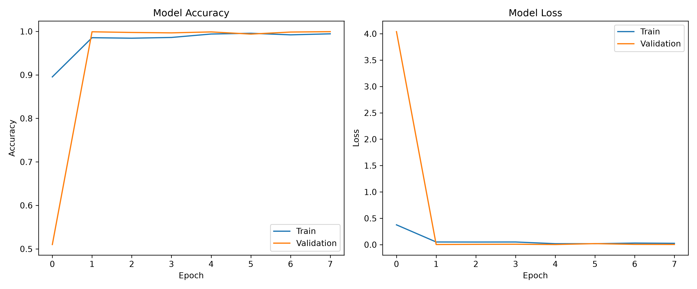
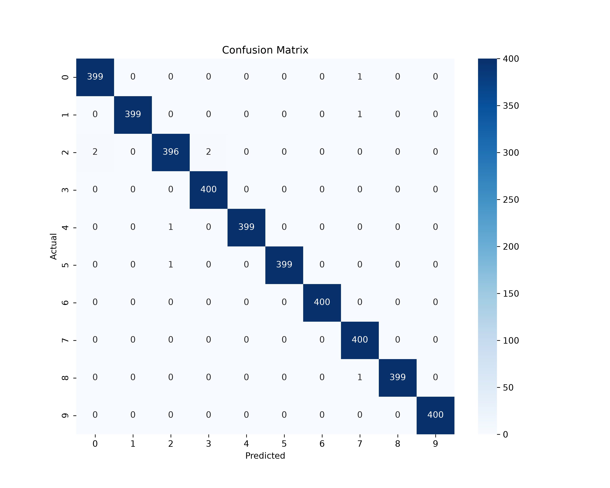

# 🖐️ Hand Gesture Recognition using CNN

## 📌 Project Overview

This project was developed as part of the **Prodigy Infotech Machine Learning Internship (Task-04)**.

The goal of this project is to build a **Convolutional Neural Network (CNN)** that can recognize different hand gestures from images. The trained model can classify a hand gesture into one of **10 different classes** with very high accuracy.

---

## 🚀 Features

- Image preprocessing using OpenCV
- CNN model built using TensorFlow/Keras
- Batch Normalization and Dropout for better performance
- EarlyStopping to prevent overfitting
- ModelCheckpoint to save the best model
- Accuracy and Loss visualization
- Confusion Matrix
- Classification Report
- Predict hand gestures from new images

---

## 🗂️ Dataset

**Dataset:** LeapGestRecog

The dataset contains grayscale images of different hand gestures performed by multiple users.

### Classes

| Label | Gesture |
|------|---------|
| 0 | Palm |
| 1 | L |
| 2 | Fist |
| 3 | Fist Moved |
| 4 | Thumb |
| 5 | Index |
| 6 | OK |
| 7 | Palm Moved |
| 8 | C |
| 9 | Down |

> **Note:** Download the LeapGestRecog dataset and place it inside the `data/` folder before running the project.

---

## 🧠 Model Architecture

The CNN model consists of:

- Conv2D
- Batch Normalization
- MaxPooling2D
- Conv2D
- Batch Normalization
- MaxPooling2D
- Flatten
- Dense Layer
- Dropout
- Output Layer (Softmax)

---

## 📊 Results

### Test Accuracy

**99.77%**

### Test Loss

**0.0079**

### Classification Report

- Precision ≈ 1.00
- Recall ≈ 1.00
- F1-score ≈ 1.00

### Confusion Matrix

Only **4 misclassifications out of 4000 test images**, demonstrating excellent model performance.

---

## 📈 Accuracy & Loss Graph



## 📉 Confusion Matrix



---

## 📁 Project Structure

```
PRODIGY_ML_04/
│
├── data/
│   └── leapGestRecog/
│
├── images/
│   ├── accuracy_loss.png
│   └── confusion_matrix.png
│
├── models/
│   └── best_hand_gesture_model.keras
│
├── notebooks/
│   └── task04.ipynb
│
├── predict.py
├── requirements.txt
├── README.md
└── .gitignore
```

---

## ⚙️ Installation

Clone the repository:

```bash
git clone https://github.com/visheshjainn16/PRODIGY_ML_04.git
```

Move into the project folder:

```bash
cd PRODIGY_ML_04
```

Create a virtual environment:

```bash
python -m venv venv
```

Activate the virtual environment:

### Windows

```bash
venv\Scripts\activate
```

Install the required libraries:

```bash
pip install -r requirements.txt
```

---

## ▶️ Run Prediction

Run:

```bash
python predict.py
```

Enter the image path when prompted.

Example:

```
data/leapGestRecog/00/01_palm/frame_00_01_0001.png
```

Example Output:

```
Predicted Gesture: Palm
Confidence: 100.00%
```

---

## 🛠️ Technologies Used

- Python
- TensorFlow / Keras
- OpenCV
- NumPy
- Matplotlib
- Seaborn
- Scikit-learn

---

## 📌 Future Improvements

- Real-time hand gesture recognition using webcam
- Deploy the model as a web application
- Improve accuracy using transfer learning
- Support custom datasets

---

## 🙏 Acknowledgements

- Prodigy Infotech
- TensorFlow
- OpenCV
- Scikit-learn
- LeapGestRecog Dataset

---

## 👨‍💻 Author

**Vishesh Jain**

B.Tech CSE (AI & ML)

Machine Learning Intern at Prodigy Infotech
